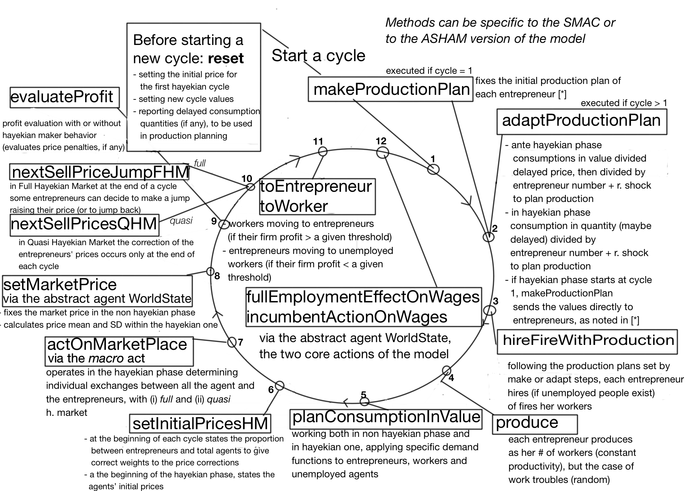

# Oligopoly
(build 20190514)

Marco Mazzoli, Matteo Morini, and Pietro Terna

The model and its construction are reported in [Oligopoly.pdf](Oligopoly.pdf). The code of the project is at [https://github.com/terna/oligopoly](https://github.com/terna/oligopoly).

A  concise presentation of the simulation mechanism is reported in the following
image:

We have also the [slides](slides_of_a_presentazione_of_the_model.pdf) of an old presentation of the Oligopoly model at [WEHIA 2017](http://www.wehia2017.com).

An article, [Business Cycle in a Macromodel with Oligopoly and Agents' Heterogeneity: An Agent-Based Approach, (2017)](http://rdcu.be/tlE6) of M.Mazzoli, M.Morini, and P.Terna, discusses the model and its results (if you experience problems in reading, please use Firefox). [Look at *Erratum* below].

The Oligopoly model uses [SLAPP](https://terna.github.io/SLAPP/) as its agent-based modeling shell.

To run a specific case of the above quoted article or of the incoming book *Rethinking macroeconomics with endogenous market structure* of M.Mazzoli, M.Morini, and P.Terna, please look at the Appendix C of the book itself or to the file [runningSpecificCases.md](https://github.com/terna/oligopoly/blob/master/runningSpecificCases.md).

______________________________________

*Erratum for the paper above*: in Table 1, the **Expected employment ratio at t=1** is **0.9** and not 0.8.
